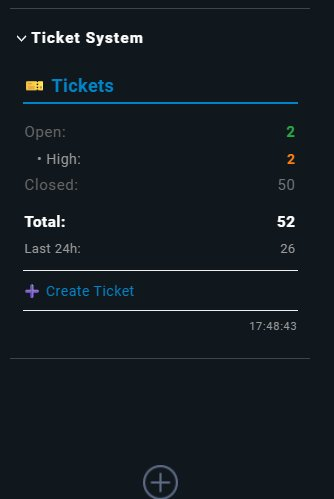

# Checkmk Ticket System Sidebar Snapin

A sidebar snapin for Checkmk 2.4+ that displays live statistics from [jbelkacemi's Checkmk Ticket System](https://github.com/jbelkacemi/checkmk_ticket_system).



## ✨ Features

- **📊 Live Statistics** - Real-time ticket counts by status
- **🎨 Priority Breakdown** - Color-coded priority display for open tickets
- **🔗 Clickable Elements** - Direct links to filtered ticket views
- **🔄 Auto-Refresh** - Updates every 30 seconds
- **⚡ Lightweight** - Direct SQLite database access, no API overhead
- **🎯 Quick Actions** - One-click access to ticket dashboard and creation

## 📸 Screenshot

The snapin displays:
- **Open tickets** with priority breakdown (Critical, High, Medium, Low)
- **Closed tickets** count
- **Total tickets** across all statuses
- **Recent activity** (last 24 hours)
- **Create Ticket** quick action button

## 🎯 Requirements

- **Checkmk 2.4.0** or higher
- **jbelkacemi's Ticket System** installed from [Checkmk Exchange](https://exchange.checkmk.com/)
- **Python 3.12+** (included with Checkmk 2.4)

## 🚀 Installation

### 1. Install jbelkacemi's Ticket System

First, ensure the Checkmk Ticket System is installed:

```bash
# Download from Checkmk Exchange or GitHub
# https://github.com/jbelkacemi/checkmk_ticket_system

# Install via Checkmk GUI:
# Setup → Maintenance → Extension Packages → Upload MKP
```

### 2. Install the Snapin

```bash
# Switch to site user
sudo su - <sitename>

# Create directory structure
mkdir -p ~/local/lib/python3/cmk/gui/plugins/sidebar

# Ensure __init__.py files exist
for dir in cmk cmk/gui cmk/gui/plugins cmk/gui/plugins/sidebar; do
    touch ~/local/lib/python3/$dir/__init__.py
done

# Copy the snapin file
cp ticket_system_snapin.py ~/local/lib/python3/cmk/gui/plugins/sidebar/ticket_system.py

# Verify Python syntax
python3 -m py_compile ~/local/lib/python3/cmk/gui/plugins/sidebar/ticket_system.py

# Clear Python cache
find ~/local/lib/python3 -type d -name "__pycache__" -exec rm -rf {} + 2>/dev/null

# Reload Apache
omd reload apache
```

### 3. Add Snapin to Sidebar

1. Open Checkmk GUI
2. Click the **"+"** button in the sidebar
3. Search for **"Ticket System"**
4. Click to add it to your sidebar

## 🎨 Features in Detail

### Clickable Statistics

All elements are interactive:

| Element | Click Action | URL |
|---------|--------------|-----|
| **🎫 Tickets** header | Open ticket dashboard | `wato.py?mode=ticket_system` |
| **Open** count | Filter open tickets | `wato.py?mode=ticket_system&filter=open` |
| **Critical** priority | Filter critical tickets | `wato.py?mode=ticket_system&priority=critical` |
| **Closed** count | Filter closed tickets | `wato.py?mode=ticket_system&filter=closed` |
| **Total** count | Open full dashboard | `wato.py?mode=ticket_system` |
| **➕ Create Ticket** | Create new ticket | `wato.py?mode=ticket_system&action=create` |

### Color Coding

Priority levels are color-coded for quick visual identification:

- 🔴 **Critical** - Red (#dc3545)
- 🟠 **High** - Orange (#fd7e14)
- 🟡 **Medium** - Yellow (#ffc107)
- ⚪ **Low** - Gray (#6c757d)

Status colors:
- 🟢 **Open** - Green (#28a745)
- ⚪ **Closed** - Gray (#6c757d)

### Auto-Refresh

The snapin automatically refreshes every **30 seconds**, synchronized with the Ticket System dashboard refresh interval.

## 🔧 Technical Details

### Database Access

The snapin directly queries the SQLite database at:
```
~/var/check_mk/ticket_system/tickets.db
```

### Database Schema (Relevant Fields)

```sql
tickets (
    ticket_id INTEGER PRIMARY KEY,
    title TEXT NOT NULL,
    status TEXT NOT NULL,           -- 'open', 'closed'
    priority TEXT NOT NULL,          -- 'critical', 'high', 'medium', 'low'
    host_name TEXT NOT NULL,
    service_description TEXT,
    created_at TIMESTAMP NOT NULL,
    updated_at TIMESTAMP NOT NULL
)
```

### SQL Queries

The snapin executes efficient queries:

```sql
-- Status breakdown
SELECT status, COUNT(*) FROM tickets GROUP BY status;

-- Priority breakdown (open tickets only)
SELECT priority, COUNT(*) FROM tickets 
WHERE LOWER(status) = 'open' 
GROUP BY priority;

-- Recent tickets (last 24h)
SELECT COUNT(*) FROM tickets 
WHERE datetime(created_at) >= datetime('now', '-1 day');
```

## 🧪 Testing

### Test Database Access

Use the included test script to verify database connectivity:

```bash
python3 test_ticket_db.py
```

**Expected output:**
```
======================================================================
JBELKACEMI TICKET SYSTEM DATABASE TEST
======================================================================

1. Database location...
   ✓ Database found!

2. Database information...
   Size: 110,592 bytes (108.0 KB)

3. Connecting to database...
   ✓ Connected successfully

4. Tables in database...
   Found 4 table(s):
   - tickets
   - ticket_history
   - schema_version
   - sqlite_sequence

5. Status breakdown...
   - 'open': 2 tickets
   - 'closed': 50 tickets

✓ TEST COMPLETE
```

### Verify Installation

```bash
# Check if file exists
ls -la ~/local/lib/python3/cmk/gui/plugins/sidebar/ticket_system.py

# Check Python syntax
python3 -m py_compile ~/local/lib/python3/cmk/gui/plugins/sidebar/ticket_system.py

# Check logs for errors
tail -f ~/var/log/web.log | grep -i "ticket\|error"
```

## 🐛 Troubleshooting

### Snapin Doesn't Appear in List

1. **Check __init__.py files:**
   ```bash
   for dir in cmk cmk/gui cmk/gui/plugins cmk/gui/plugins/sidebar; do
       ls -la ~/local/lib/python3/$dir/__init__.py
   done
   ```

2. **Clear cache completely:**
   ```bash
   find ~/local/lib/python3 -type d -name "__pycache__" -exec rm -rf {} + 2>/dev/null
   find ~/lib/python3 -type d -name "__pycache__" -exec rm -rf {} + 2>/dev/null
   omd restart
   ```

3. **Check for Python errors:**
   ```bash
   tail -50 ~/var/log/web.log | grep -i error
   ```

### "Database Not Found" Error

1. **Verify Ticket System is installed:**
   ```bash
   ls -la ~/var/check_mk/ticket_system/tickets.db
   ```

2. **Check database permissions:**
   ```bash
   # Should be readable by site user
   stat ~/var/check_mk/ticket_system/tickets.db
   ```

3. **Install jbelkacemi's Ticket System** if not present

### Shows Old Data / Doesn't Refresh

1. **Check refresh settings:**
   - Snapin auto-refreshes every 30 seconds
   - Browser cache might need clearing

2. **Force refresh:**
   - Press `Ctrl+Shift+R` (hard refresh)
   - Reload Apache: `omd reload apache`

## 📊 Performance

- **Database queries:** ~10ms on average
- **Memory usage:** < 5MB
- **Refresh interval:** 30 seconds
- **No external API calls** - Direct SQLite access for speed

## 🔒 Security

- **Read-only database access** - Uses SQLite read-only mode
- **No SQL injection** - Parameterized queries only
- **No user input** - Static queries, no dynamic SQL
- **Timeout protection** - 5-second query timeout

## 📝 Customization

### Change Refresh Interval

Edit the snapin file:

```python
@classmethod
def refresh_interval(cls):
    return 60  # Change to 60 seconds (default: 30)
```

### Modify Colors

Adjust the priority color mapping:

```python
priority_colors = {
    'critical': '#your_color',
    'high': '#your_color',
    'medium': '#your_color',
    'low': '#your_color'
}
```

### Add Custom Queries

Extend the `show()` method with additional statistics:

```python
# Example: Count by category
cursor.execute("""
    SELECT category, COUNT(*) 
    FROM tickets 
    WHERE LOWER(status) = 'open' 
    GROUP BY category
""")
category_results = cursor.fetchall()
```

## 🤝 Contributing

Contributions are welcome! Please:

1. Fork the repository
2. Create a feature branch
3. Test thoroughly on Checkmk 2.4+
4. Submit a pull request

## 📄 License

This snapin is provided as-is for use with jbelkacemi's Checkmk Ticket System.

## 🔗 Related Links

- **jbelkacemi's Ticket System:** https://github.com/jbelkacemi/checkmk_ticket_system
- **Checkmk Documentation:** https://docs.checkmk.com/
- **Checkmk Exchange:** https://exchange.checkmk.com/
- **Checkmk Plugin API:** https://docs.checkmk.com/plugin-api/

## 📮 Support

For issues related to:
- **This snapin:** Open an issue in this repository
- **jbelkacemi's Ticket System:** Visit the [original repository](https://github.com/jbelkacemi/checkmk_ticket_system)
- **Checkmk itself:** Visit [Checkmk Forum](https://forum.checkmk.com/)

## ✅ Changelog

### Version 1.0.0 (2026-02-13)
- ✨ Initial release
- 📊 Status and priority statistics
- 🔗 Clickable elements for filtering
- 🔄 Auto-refresh every 30 seconds
- ➕ Quick action buttons
- 🎨 Color-coded priorities
- ⚡ Direct SQLite access

## 🙏 Credits

- **Ticket System:** [jbelkacemi](https://github.com/jbelkacemi) - Original Checkmk Ticket System
- **Snapin Development:** Based on Checkmk 2.4 Sidebar API
- **Testing:** Tested on Checkmk 2.4.0p1

---

**Made with ❤️ for the Checkmk Community**
